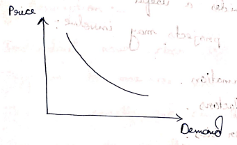
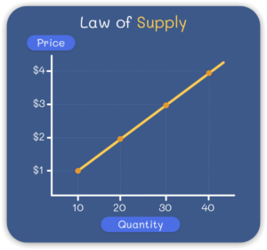

import Indent from "@site/src/components/Indent";

## 1. What are the central problems of economy?

Because resources are limited but human wants are unlimited,
every economy faces three fundamental questions:

- **What to Produce & how much to produce**: The ecomony has to decide what to produce and in what quantity.
- **How to Produce**: The ecomony has to choose the method of production, wheather labour intensive or capital intensive.
- **For whom to produce**: The economy has to choose how the produced goods and services will be distributed among different people in society.

---

## 2. What do you mean by opportunity cost?

Opportunity cost refers to the value of the next best alternative that is sacrificed when a choice is made.
Since resources are limited, choosing one option means giving up another option.

<Indent /> Therefore, the benefit of the forgone alternative is called
opportunity cost.

**Opportunity Cost = What we give up / Sacrifice to get something else.**

<big>**Example:**</big>

If a person spends money on a mobile phone instead of a laptop, then the benefit of the laptop is the opportunity cost.

---

## 3. State the law of demand.

The law of Demand states that, while other factors remain constant, there is a inverse relationship between `price` and `quantity demanded` of a product.

<Indent /> As the `price` of the product increases, the `quantity demanded`
decreases and vice-versa. This inverse relationship forms the basis of the
demand curve, which is typically downwards sloping.

<big>**Graphically:**</big>
<br />



**where:**

- **X-axis:** quantity demanded
- **Y-axis:** Price
- **Downward slope:** shows that as price decrease then demand increase.

### Types of Demand

There are two main types of demand:

- Individual Demand
- Market Demand

:::note
more about demands definations later
:::

---

## 4. How demand curve shifts along with quantity demand?

Movement along the demand curve means a change in `quantity demanded` due to a change in the `price of a commodity`,
while other factors remain constant.

- When the price decreases, quantity demanded increases. This is called **extension of demand.**
- When the price increases, quantity demanded decreases. This is called **contraction of demand.**

<big>**Example:**</big>

If the price of a product falls from ₹50 to ₹30, consumers buy more of it. This causes movement along the same demand curve.

---

## 5. What is price elasticity of demand?

Price elasticity of demand (PED) measures how much the quantity demanded of a product changes when its price changes.

The formula is:

```math
PED = \frac{\% \text{ change in quantity demanded}}{\% \text{ change in price}}
```

**If**

- $PED > 1 \rightarrow \text{Demand is elastic}$: Consumers are very responsive to price changes.
- $PED < 1 \rightarrow \text{Demand is inelastic}$: Consumers are not very responsive to price changes.
- $PED = 1 \rightarrow \text{Unit elastic}$: Percentage change in demand equals percentage change in price.

:::note
practice numericals
:::

---

## 6. State the law of supply.



The Law of Supply states that while other factors remains constant, there is a direct relationship between `price` and `quantity supplied` of a commodity.

<Indent /> When the `price` of a commodity increases, its quantity supplied also
increases. Similarly, when the price decreases, quantity supplied decreases.

<big>**Example**</big>

- If the price of mangoes rises, sellers will supply more mangoes.
- If the price falls, sellers will supply fewer mangoes.

:::note
here we are actually talking about profit.

<details>

like for a mango chasi:

- **When the market price of mangoes is high:** You want to take advantage of those high prices. You'll pull out all the stops to harvest, pack, and supply as many mangoes to the market as possible because every single sale brings in a massive profit margin.

- **When the market price of mangoes drops low**: Your profit margin shrinks. It might barely cover the cost of picking them and paying for transport. As a result, you back off. You supply fewer mangoes to the market, perhaps holding onto stock or switching your resources to a more profitable fruit.

</details>

:::

---

## 7. What do you mean by economics and engineering economics?

### Economics

Economics is a social science that studies how people and society use limited resources to satisfy unlimited human wants.
It deals with the production, distribution, consumption, and exchange of goods and services.

### Engineering Economics

Engineering economics is a branch of economics that applies economic principles and techniques to engineering projects and decisions.
It helps engineers compare costs, benefits, and alternatives in order to select the most economical and efficient solution.

---

## 8. What do you mean by individual demand and market demand?

### Individual Demand

Individual demand refers to the quantity demanded by a single consumer of a commodity at a point of time at different prices.

Individual demand curve establishes the relationship between quantity demanded by a consumer as price changes.

### Market Demand

Market demand curve shows the aggregate quantity that all the consumers of a commodity are willing and able to buy at a point of time in the market at different possible prices.

The market demand curve indicates the relationship between the total quantity demanded and market price of the commodity.

---

## 9. Define the terms determinants of demand, demand function, elastic and non-elastic goods.

### Determinants of Demand

Determinants of demand are the factors that affect the demand for a commodity, such as price, income, taste, population, and prices of related goods.

### Demand Function

Demand function shows the relationship between the demand for a commodity and the factors affecting it, especially its price.

### Elastic Goods

Elastic goods are those goods whose demand changes greatly due to a small change in price.

**Example:** Luxury items, branded clothes.

### Non-Elastic (Inelastic) Goods

Non-elastic goods are those goods whose demand changes very little even when the price changes.

**Example:** Salt, medicines.

---

## 10. Derive the relationship between price, total revenue & price elasticity of demand.

Relationship b/w price , total revenue (TR) and Price Elasticity :-

- $TR = \text{Price} \times \text{quantity}$

**Mathematical Relationship:**

```math
\frac{\partial (TR)}{\partial P} = Q + \frac{P \cdot \partial Q}{\partial P}
```

```math
E_p = \frac{\partial Q}{\partial P} \times \frac{P}{Q} \implies \frac{\partial (TR)}{\partial P} = Q + Q E_p \text{ [using Elasticity]}
```

```math
\implies \frac{\partial Q}{\partial P} \cdot P = E_p Q \implies \frac{\partial (TR)}{\partial P} = Q (1 + E_p)
```

- If $E_p > 1 \rightarrow \text{TR increase and price decrease}.$
- If $E_p < 1 \rightarrow \text{TR decrease and price increase}.$
- If $E_p = 1 \rightarrow \text{TR is unchanged}.$

---

## 11. What are the causes of scarcity of resources?

scarcity is the fundamental economic condition where limited resources are insufficient to satisfy unlimited human wants.

This discrepancy forces individuals, businesses, and governments to make choices about how to allocate resources efficiently, leading to concepts like opportunity cost and trade-offs.

1. **Unlimited Human Wants:** Human wants are unlimited, but resources are limited.
2. **Limited Availability of Resources:** Natural resources like land, water, and minerals are available in limited quantity.
3. **Increase in Population:** Growing population increases the demand for resources.
4. **Misuse of Resources:** Wastage and overuse of resources create scarcity.
5. **Unequal Distribution:** Resources are not equally distributed among people and regions.

---

## 12. State the relationship between engineering and economics.

Engineering and economics are deeply interconnected. Hence shown:

| Engineering                                          | Economics                                               |
| :--------------------------------------------------- | :------------------------------------------------------ |
| Focuses on design development, operation of systems. | Focuses on cost, value and efficiency of resources use. |
| Solves technical problem.                            | Solve resource allocation problem.                      |
| Aims to improve performance and productivity.        | Aims to optimize profit and minimize cost.              |
| Used tools like CAD, simulation, modeling etc.       | Uses tools like NPV, IRR, cost benefit analysis.        |

Together engineering and economics aims to deliver solutions that are technically sound, economically viable and sustainable.

---

## 13. Write the supply function.

**Supply Function**

A Supply function is a mathematical expression that shows the relationship b/w quantity supplies and its determinants.

```math
Q_s = f(P, P_i, T, N, E, G_t)
```

**where**,

- $Q_s = \text{Quantity supplied}$
- $P = \text{Price of good}$
- $P_i = \text{Price of inputs}$
- $T = \text{Technology}$
- $N = \text{Number of sellers}$
- $E = \text{Expectation of future Price}$
- $G_t = \text{Govt. policies (Taxes \& subsidies)}$

### Market Supply Function

Market supply function shows the relationship between the total supply of all sellers in the market and the factors affecting it.

```math
MS = \sum S_x

```

**Where:**

- $MS = \text{Market Supply}$
- $\sum S_x = \text{Sum of individual supplies of all sellers}$

### Individual Supply Function

Individual supply function shows the relationship between the quantity supplied by an individual seller and the factors affecting it.

```math
S_x = f(P_x)
```

**Where:**

- $S_x = \text{Supply of commodity X}$
- $P_x = \text{Price of commodity X}$
