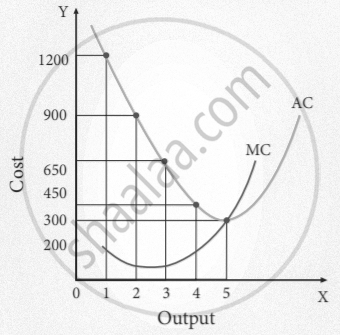
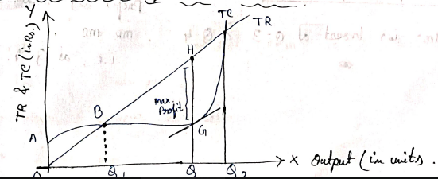

## 1. Difference between short run and long run.

| Short Run                                                                     | Long Run                                                                |
| :---------------------------------------------------------------------------- | :---------------------------------------------------------------------- |
| At least one input is fixed (e.g., land, factory size).                       | All inputs are variable.                                                |
| Costs are divided into Fixed Costs (FC) and Variable Costs (VC).              | All costs become variable costs.                                        |
| Existing firms cannot scale fully or exit, new firms cannot enter the market. | Firms have total freedom to enter or exit the market.                   |
| **Governed by the Law of Variable Proportions)** (Diminishing Returns).       | **Governed by Returns to Scale** (Constant, Increasing, or Decreasing). |

<br />

:::note[[Extra] Short Long Run]

<details>
- **Short Run**: A period during which at least one production input is fixed and cannot be changed (typically capital, factory size, or heavy machinery). Production can only be increased by altering variable inputs like labor or raw materials.

- **Long Run**: A period during which all inputs are variable. Given enough time, a firm can expand its factory scale, buy new land, install new machinery, or exit the industry entirely.

</details>

:::

---

## 2. What is production and cost?

### A. Production

Production is the process where economic inputs (like raw materials, labor, and capital) are converted/processed into outputs of goods & services that satisfy human wants.

Mathematically, this relationship is expressed as a **Production Function**:

```math
Q = f(L, K)
```

**Where:**

- $Q = \text{Quantity of output}$
- $L = \text{Labor input}$
- $K = \text{Capital input}$

### B. Cost

Cost refers to the total money spent by a firm in order to get the resources (inputs) required for production.

Costs behave differently depending on the production timeline:

**A. Short-Run Costs**

In the short run, total costs are split into two categories:

- **Fixed Costs (FC):** Expenses that do not change with the level of output (e.g., rent, salaries of permanent staff, machinery). They must be paid even if production is zero.

- **Variable Costs (VC):** Expenses that change directly with the volume of production (e.g., raw materials, electricity, casual labor).

<center>**Total Cost (TC) = Fixed Cost (FC) + Variable Cost (VC)**</center>

**B. Long-Run Costs**

In the long run, because a firm can alter its factory size, equipment, and all other assets, there are no fixed costs. All commitments become flexible.

<center>**Total Cost (TC) = Long-Run Variable Cost (LVC)**</center>

<br />

:::note[Extra]
**Short Run Costs**

Short-run costs refer to the expenses incurred by a business in the production process when at least one factor of production is fixed and cannot be easily adjusted.
In the short run, certain costs are considered fixed, while others are variable.

**Long Run costs**

Long-run costs, refer to the expenses incurred by a business when all factors of production can be adjusted and there are no fixed inputs.
In the long run, businesses have the flexibility to modify all inputs, including plant size, equipment, and labor. Therefore, all costs are variable in the long run.

:::

---

## 3. What is law of return to scale?

The **Law of Returns to Scale** is a long-run production theory that examines how output changes when **all inputs** (labor and capital) are increased simultaneously in the same proportion.

Unlike the short run, where some inputs are fixed, the scale of production changes entirely in the long run.

### Three Stages of Returns to Scale

#### 1. Increasing Returns to Scale (IRS)

IRS occurs when the percentage change in output is **greater than** the percentage change in inputs. If we double all inputs, our output more than doubles.

- **Mathematical Expression:** $f(m\cdot L, m\cdot K) > m \cdot f(L, K)$ where $m > 1$. (L = Labour, K = Capital, m = scale factor)
- **Causes:** Specialization of labor, introduction of advanced machinery, and bulk-discounts on raw materials etc.

#### 2. Constant Returns to Scale (CRS)

CRS occurs when the percentage change in output is **exactly equal to** the percentage change in inputs. If we double all inputs, our output exactly doubles.

- **Mathematical Expression:** $f(m\cdot L, m\cdot K) = m \cdot f(L, K)$ where $m > 1$.
- **Causes:** The balance point where advantages are perfectly offset by disadvantages. It is also known as a **linear homogeneous production function**.

#### 3. Decreasing Returns to Scale (DRS)

DRS occurs when the percentage change in output is **less than** the percentage change in inputs. If we double all inputs, our output increases by less than double.

- **Mathematical Expression:** $f(m\cdot L, m\cdot K) < m \cdot f(L, K)$ where $m > 1$.
- **Causes:** Usually caused by managerial inefficiencies, lack of communication, and bottlenecks when a firm grows too large.

---

## 4. Explain various types of cost

### A. Total Fixed Cost (TFC)

Costs that do not change with the level of output (e.g., rent, insurance).

**These must be paid even if production is zero.**

### B. Total Variable Cost (TVC)

Costs that change directly with the level of output (e.g., raw materials, direct labor).

**When output is zero, TVC is zero.**

### C. Total Cost (TC)

The sum of both fixed and variable costs at any given level of output.

```math
\text{TC} = \text{TFC} + \text{TVC}
```

### D. Average Fixed Cost (AFC)

Average Fixed Cost is the fixed cost per unit of output produced.

It is obtained by dividing Total Fixed Cost (TFC) by the quantity of output. _As output increases, AFC decreases_ because the fixed costs are spread over more units.

```math
\text{AFC} = \frac{\text{TFC}}{Q}
```

### E. Average Variable Cost (AVC)

Average Variable Cost (AVC) is the variable cost per unit of output produced.

It represents the Total Variable Cost (TVC) divided by the quantity of output. Unlike fixed costs, variable costs fluctuate directly with production levels.

```math
\text{AVC} = \frac{\text{TVC}}{Q}
```

### F. Average Cost (AC) or Average Total Cost (ATC)

The total cost per unit of output produced. It is the sum of AFC and AVC.

```math
\text{AC} = \frac{\text{TC}}{Q} = \text{AFC} + \text{AVC}
```

### G. Marginal Cost (MC)

Marginal cost is the additional cost that a business incurs when it produces one more unit of a product.

```math
\text{MC}_n = \text{TC}_n - \text{TC}_{n-1} = \frac{\partial(\text{TC})}{\partial Q}
```

---

## 5. Write down the relationship between AC and MC.

The relationship between Marginal Cost (MC) and Average Cost (AC) is defined by their intersection and relative positions, which determine the direction of the AC curve.

MC intersects AC at its minimum point, and the slope of the AC curve depends on whether MC is above or below it.

- **When $\text{MC} < \text{AC}$:** The AC is **falling**. As long as the cost of producing an additional unit is less than the current average, it pulls the average down.
- **When $\text{MC} = \text{AC}$:** The AC is **constant and at its minimum**. This is the optimum efficiency point where the MC curve cuts the AC curve from below.
- **When $\text{MC} > \text{AC}$:** The AC is **rising**. Once the cost of the next unit exceeds the average, it pulls the average up.



---

## 6. What is profit? How do you maximize profit for an organization?

### What is Profit?

In economics, profit is the difference between total revenue and total cost, where all explicit and implicit costs are considered.
It is the ultimate reward to entrepreneurs for taking risks in the market.

The basic financial formula for profit is:

<center>**Profit (\pi) = Total Revenue (TR) - Total Cost (TC)**</center>

Types of Profit:

- **Accounting Profit**: $\text{Total Revenue} - \text{explicit costs}$
- **Economic Profit** : $\text{Total income} - (\text{explicit cost} + \text{implicit cost})$
- **Normal Profit** : Minimum profit needed to keep a firm in business. (zero economic profit)
- **Super - normal profit**: Profit above normal profit. (Positive economic profit)

### Profit Maximization

A firm maximizes its profit by producing the output level where Marginal Revenue ($MR$) equals Marginal Cost ($MC$):

```math
MR = MC
```

**Where:**

- **$MR$ (Marginal Revenue):** $\frac{\Delta TR}{\Delta Q}$
- **$MC$ (Marginal Cost):** $\frac{\Delta TC}{\Delta Q}$

**If**

- $MR > MC \rightarrow$ Increase output.
- $MR < MC \rightarrow$ Reduce output.
- $MR = MC \rightarrow$ Profit is maximized.



---

## 7. Define cost of production.

Cost of production is all the costs that a company incurs when offering a service or manufacturing a product.

It comprises various expenses, including the cost of materials, employee wages, factory maintenance and shipping costs.<br/>
Production costs also include state and federal taxes imposed on a company's manufacturing processes or facilities.

<center>
    **Cost of Production (TC) = Total Fixed Cost (TFC) + Total Variable Cost
    (TVC)**
</center>

<br />

<big>Thre are broadly two primary categories of expenses:</big>

### Explicit Costs

Direct, out-of-pocket monetary payments made by a firm for purchasing or hiring inputs.

**Examples:**

- Employee wages
- Payments for raw materials
- Electricity bills
- Rent for factory space

### Implicit Costs

Implicit cost is the cost of using self-owned resources in production for which no direct cash payment is made.<br/>
It represents opportunity costs of self-owned resources.

**Examples:**

- Salary sacrificed by bussinessman working on his own bussiness
- Forgone rent of self-owned factory used for bussiness

<br />

:::note

- Implicit costs -> also known as imputed or opportunity costs)
- Forgone means which is not being taken
  :::
