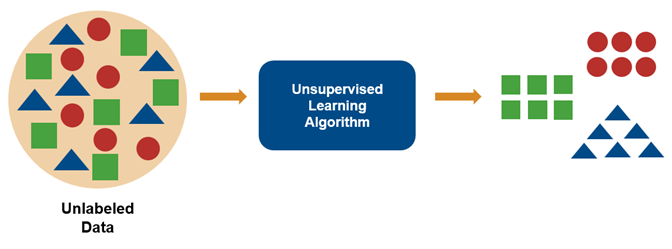

import Indent from "@site/src/components/Indent";
import LogisticImg from "./assets/logistic-regression.jpg";
import DcsnTreeImg from "./assets/decision-tree.jpeg";

## 1. What Do You Mean by Machine Learning? Discuss It

Machine Learning (ML) is a branch of artificial intelligence (AI) that focuses on building systems that learn from data.

<Indent /> In basic terms, ML is the process of training a piece of software,
called a model, so that it can make useful predictions. Instead of writing a
traditional program with hard-coded rules to solve a problem, we feed an ML
model massive amounts of data. The model analyzes this data, finds underlying
patterns, & builds a mathematical model to make predictions or decisions on its
own.

<Indent /> Think of it like teaching a child to recognize a dog. We don't
explain the exact geometry of a dog's nose or the precise texture of its fur.
Instead, you show them dozens of pictures of dogs. Eventually, the child's brain
figures out the patterns that make a dog a dog. Machine learning works the exact
same way.

<big>**Types of ML :-**</big>

<br />
<br />

1. **Supervised Learning**: The algorithm is trained on a labeled dataset.
2. **Unsupervised Learning**: The algorithm is given unlabeled data.
3. **Reinforcement Learning**: Agents learn to make decisions in a dynamic environment through trial and error.

:::note[Model in ML]
An ML model is the final output of a machine learning algorithm, representing the learned patterns and rules in a mathematical or statistical format.
:::

---

## 2. Types of ML & Their Algorithms

Machine Learning is categorized into 3 main types:

A. Supervised Learning<br />
B. Unsupervised Learning<br />
C. Reinforcement Learning

### A. Supervised Learning

Supervised learning is a machine learning technique where algorithms are trained using **labeled data** to map input features to known output labels.<br />
During training, the model learns the relationship between inputs and correct answers, allowing it to make predictions on new, unseen data with high accuracy.

This approach is primarily divided into two categories:

- **Classification**: A supervised learning technique that assigns data into predefined categories or classes.
- **Regression**: A supervised learning technique used to predict continuous numerical values based on input data. For example, predicting house prices based on features like size, location, and age.

<big>**Core Algorithms**</big>

<br />
<br />

<u>
  <big>**1. Linear Regression**</big>
</u>

Linear regression is the most commonly used regression model in ML. It can be defined as a statistical model that analyzes the linear relationship between the dependent variable and a given set of independent variables.

A linear relationship between variables means that when the value of one or more independent variables changes, the value of the dependent variable also changes accordingly.

Linear regression is further divided into 2 categories: simple linear regression and multiple linear regression.

**Equation**: `y = mx + c` (where y is the dependent variable, x is the independent variable, m is the slope, and c is the intercept)

<big>
  <u>**2. Logistic Regression**</u>
</big>
<br />


<br />

Logistic regression is a supervised learning classification algorithm used to predict the probability of a target variable. The nature of the target or dependent variable is binary, so there are only 2 possible classes or categories.

The dependent variable is binary in nature (either 1/yes/true or 0/no/false).

In logistic regression, we use a function to find the dependent value (Y). The name of the function is **sigmoid function**: `Y = 1 / (1 + e^{-x})` (where x is the independent variable, Y is the dependent variable).

<big>
  <u>**3. Decision Tree**</u>
</big>

A decision tree is a supervised learning algorithm used for both classification and regression tasks that organizes decisions in a hierarchical, tree-like structure resembling a flowchart.
It works by recursively splitting the dataset into smaller, more homogeneous subsets based on feature values, starting from a root node (the entire dataset) and branching through internal nodes (attribute tests) until reaching leaf nodes (final predictions or class labels).


<br />

### B. Unsupervised Learning

Unsupervised learning is a type of machine learning where the model is trained using an **unlabeled dataset**.

Unlike supervised learning, the model has no hints on how to categorize each piece of data.
The system receives only input features and has to find the patterns and relationships within the data. Its primary focus is data exploration and pattern discovery.

This approach is primarily divided into two categories:

- **Clustering**: Grouping similar data points together.
- **Dimensionality Reduction**: Compressing heavy data by removing redundant features while keeping key information.

#### Core Algorithms

<u>1. **K-Means Clustering**</u>

K-means clustering is an unsupervised machine learning algorithm that partitions
unlabeled data into K non-overlapping clusters based on similarity, typically
measured by Euclidean distance. It is widely used for its speed and simplicity
in identifying patterns within large datasets.

<u>2. **PCA (Principal Component Analysis)**</u>

PCA is a dimensionality reduction technique commonly used in machine learning and data analysis to reduce the number of features while preserving as much information as possible.

It achieves this by finding the principal components of the data, which are orthogonal vectors that capture the most significant variance in the data.

### C. Reinforcement Learning

Reinforcement learning is a type of machine learning where models are trained in a dynamic environment. The model learns through getting rewards or penalties based on actions performed.

The goal of the agent is to learn the best strategy (policy) that maximizes the total reward over time.

Reinforcement learning is used to train robots to perform tasks, like walking around a room, and software programs like AlphaGo to play the game of Go.

#### Core Algorithms

- **Q-Learning**: Learns the optimal action-value function Q(s,a).
- **Deep Q-Network (DQN)**: Uses neural networks to approximate Q-values, enabling learning from high-dimensional inputs like images.

---

## 3. Supervised Vs Unsupervised Learning

| Supervised Learning                                                                      | Unsupervised Learning                                                       |
| ---------------------------------------------------------------------------------------- | --------------------------------------------------------------------------- |
| Uses labeled data.                                                                       | Uses unlabeled data.                                                        |
| Learns by mapping inputs to known outputs.                                               | Learns by discovering hidden patterns and structures in data.               |
| Receives feedback by comparing predictions with actual labels.                           | No feedback mechanism as there are no known labels.                         |
| Requires manually labeled data before training.                                          | Requires little to no manual labeling.                                      |
| Generally less complex and easier to train.                                              | Generally more complex and computationally intensive to train.              |
| Used for Classification and Regression.                                                  | Used for Clustering, Dimensionality Reduction, and Association Rule Mining. |
| Uses algorithms such as Linear Regression, Logistic Regression, SVM, and Decision Trees. | Uses algorithms such as K-Means Clustering, PCA, and Apriori Algorithm.     |

---

## 4. Discuss Unsupervised Learning and How It Works

Unsupervised learning is a type of machine learning where the model is trained using an **unlabeled dataset**.

Unlike supervised learning, the model has no hints on how to categorize each piece of data.
The system receives only input features and has to find the patterns & relationships within the data. Its primary focus is data exploration and pattern discovery.

<big>**How It Works**</big>

Since there are no correct answers or labels, the algorithm cannot use an error rate to correct itself. Instead, it relies on mathematical distance to organize data.

<center>



</center>

1. **Feature Mapping**: The algorithm places all the data points on a hidden mathematical graph based on their features.
2. **Centroids Initialization**: The user specifies **K** (the number of groups wanted). The algorithm places **K** random starting points, called _centroids_, in the graph.
3. **Distance Calculation**: The algorithm measures the distance between every data point and each centroid.
4. **Cluster Assignment**: Each data point is assigned to its nearest centroid to form temporary groups called _clusters_.
5. **Centroid Update**: The algorithm calculates the average position (mean) of all points in a group and moves the centroid to that new center.
6. **Repetition**: Steps 3 to 5 are repeated iteratively until the centroids stop moving, creating the final stabilized clusters.

---

## 5. What Is PCA. How Does It Work

PCA (Principal Component Analysis) is a dimensionality reduction technique used to reduce the number of variables (dimensions) in a dataset while preserving most of the important information.

It helps simplify large and complex datasets, making them easier to analyze and process.

**Why PCA Is Used**

- Reduces the number of variables in a dataset.
- Removes redundancy caused by correlated variables.
- Reduces computational complexity.
- Helps in data visualization and preprocessing.

**How PCA Works**

1. Collect the dataset.
2. Find the relationships between variables.
3. Identify the directions with the highest variation in the data.
4. Create new variables called Principal Components.
5. Keep the most important components and remove less important ones.
6. Obtain a smaller and simpler dataset.

**Applications of PCA**

- Image compression
- Face recognition
- Data visualization
- Pattern recognition
- Machine learning and data mining

---

## 6. What Do You Mean by Clustering? Types of Clustering

Clustering is the unsupervised learning technique that groups similar data objects into clusters so that objects within the same cluster are more similar to each other than those in different clusters.

The main goal of clustering is to discover hidden patterns and structures in data.

**Example**

In a shopping mall, customers can be grouped based on their purchasing behavior. Customers with similar buying habits belong to the same cluster.

<big>
  <u>**Types of Clustering**</u>
</big>

<br />
<br />

<big>**A. Partitioning Clustering**</big>

Divides data into a predefined number of clusters.

**Example**: K-Means Clustering.

<big>**B. Hierarchical Clustering**</big>

Creates a hierarchy of clusters in the form of a tree (dendrogram).

Can be Agglomerative (bottom-up) or Divisive (top-down).

**Example**: Hierarchical Agglomerative Clustering (HAC).

<big>**C. Density-Based Clustering**</big>

Forms clusters based on dense regions of data separated by sparse regions.

Can identify clusters of arbitrary shapes and detect outliers.

**Example**: DBSCAN (used to detect geographical hotspots from GPS location data).

<big>**D. Grid-Based Clustering**</big>

Divides the data space into a finite number of cells (grids) and forms clusters from them.

**Example**: STING (Used in Geographic Information Systems for analyzing spatial data).

<big>**E. Model-Based Clustering**</big>

Assumes that data is generated from a statistical model and clusters data accordingly.

**Example**: Gaussian Mixture Model (GMM) (used for image segmentation and pattern recognition).

---

## 7. What is Decision Tree? write down the algorithm

A Decision Tree is a supervised machine learning algorithm used for classification and regression tasks.<br />
It represents decisions and their possible outcomes in the form of a tree-like structure consisting of root nodes, internal nodes, branches, and leaf nodes.

<center>
```txt
Root Node
|
Decision
/    \
Yes      No
|         |
Leaf Node  Leaf Node
```
</center>

**Decision Tree Algorithm**

1. Start with the complete training dataset.
2. Select the best attribute using a measure such as Information Gain or Gini Index.
3. Create a decision node based on the selected attribute.
4. Split the dataset into subsets according to the attribute values.
5. Repeat the process for each subset.
6. If all records belong to the same class, create a leaf node.
7. Continue until no further splitting is possible.
8. The resulting tree is used for prediction and classification.

---

## 8. Classification vs Regression

| Classification                                               | Regression                                            |
| ------------------------------------------------------------ | ----------------------------------------------------- |
| Predicts categories or classes.                              | Predicts continuous numerical values.                 |
| Output is discrete (fixed classes).                          | Output is continuous (numeric value).                 |
| Used for classification problems.                            | Used for regression problems.                         |
| Answers "Which category?"                                    | Answers "How much?" or "How many?"                    |
| Algorithms: Decision Tree, Naive Bayes, Logistic Regression. | Algorithms: Linear Regression, Polynomial Regression. |
| Example: Spam or Not Spam.                                   | Example: House Price Prediction.                      |

---

## 9. Linear vs Logistic Regression

| Linear Regression                                                       | Logistic Regression                                                      |
| ----------------------------------------------------------------------- | ------------------------------------------------------------------------ |
| Used to predict **continuous numerical values**.                        | Used to predict **categorical values (classes)**.                        |
| Output can be any real number.                                          | Output is a probability between 0 and 1.                                 |
| Uses a **linear equation** to model the relationship between variables. | Uses the **sigmoid function** to model probabilities.                    |
| Suitable for regression problems.                                       | Suitable for classification problems.                                    |
| Performance is measured using MAE, MSE and R² Score.                    | Performance is measured using Accuracy, Precision, Recall, and F1-Score. |
| Examples: House price prediction, sales forecasting.                    | Examples: Spam detection, disease diagnosis.                             |

---

## 10. What Do You Mean by Reinforcement Learning?

Reinforcement learning is a type of machine learning where models are trained in a dynamic environment. The model learns through getting rewards or penalties based on actions performed.<br />

The goal of the agent is to learn the best strategy (policy) that maximizes the total reward over time.

Reinforcement learning is used to train robots to perform tasks, like walking around a room, and software programs like AlphaGo to play the game of Go.

**How Reinforcement Learning Works**

1. The agent observes the current state of the environment.
2. It takes an action based on that state.
3. The environment responds with a reward or penalty and a new state.
4. The agent learns from this feedback and improves its future actions.
5. This process continues until the agent learns the optimal behavior.

**Components of Reinforcement Learning**

- **Agent**: The learner or decision-maker.
- **Environment**: The system in which the agent operates.
- **State**: The current situation of the environment.
- **Action**: A decision taken by the agent.
- **Reward**: Feedback received after performing an action.

**Example**

A robot learning to move in a room:

- If it reaches the target, it gets a reward.
- If it hits an obstacle, it receives a penalty.
- After many attempts, it learns the best path.

**Applications**

- Robotics
- Self-driving cars
- Game playing (Chess, Chess engines, etc.)
- Recommendation systems
- Resource management

---

## 11. What Is 'ANN'. Perceptron. and Its Layers

### ANN

An **Artificial Neural Network (ANN)** is a machine learning model inspired by the structure and functioning of the human brain.

It consists of interconnected processing units called neurons, which work together to learn patterns from data and make predictions or decisions.

**Features of ANN**

- Learns from training data.
- Can handle complex and non-linear problems.
- Used in pattern recognition, image processing, speech recognition, and prediction tasks.

### Perceptron

A Perceptron is the simplest type of artificial neuron and the basic building block of an ANN.

It receives input values, applies weights, computes a weighted sum, and produces an output using an activation function.

**Working of a Perceptron**

1. Receive input values.
2. Multiply each input by its corresponding weight.
3. Calculate the weighted sum.
4. Apply an activation function.
5. Produce the output.

#### Layers of Perceptron

<big>**1. Input Layer**</big>

First layer of the network. Receives input data from the user or dataset. Passes
data to the hidden layer.

**Example**: Student marks, age, and attendance.

<big>**2. Hidden Layer**</big>

Located between the input and output layers. Performs calculations and extracts
important features. There can be one or more hidden layers.

**Example**: Finding patterns in student performance data.

<big>**3. Output Layer**</big>

This is the final layer of the network. This layer produces the result or prediction.

**Example**: Predicting whether a student will pass or fail.

---

## 12. Discuss Genetic Algorithm. How It Works?

A Genetic Algorithm (GA) is a search and optimization technique in Artificial Intelligence inspired by the process of **natural selection and genetics**.

It is used to find the near-optimal solution to a problem by repeatedly improving a set of candidate solutions.

<big>**How Genetic Algorithm Works**</big>

<br />
<br />

:::note[Check Next Question]
:::

---

## 13. Steps for GA's. Discuss Briefly

### A. Population Initialization

Generate an initial population of random solutions (chromosomes).<br />
Each chromosome represents a possible solution.

### B. Fitness Evaluation

Calculate the fitness value of each chromosome.<br />
The fitness function measures how good a solution is.

### C. Selection

Select the best chromosomes as parents based on their fitness.<br />
Better solutions have a higher chance of being selected.

### D. Crossover

Combine two parent chromosomes to create new offspring with characteristics of both parents.<br />
This helps produce better solutions.

### E. Mutation

Randomly change some genes in the offspring.<br />
Mutation introduces diversity and prevents premature convergence.

### F. Replacement

Replace weaker chromosomes with newly generated offspring.<br />
Form a new population.

### G. Termination

Repeat the above steps until a stopping condition is met, such as:

- Desired solution found
- Maximum number of generations reached

---

## 14. What Do You Mean by Fitness Value and Convergence?

### Fitness Value

A Fitness Value is a numerical measure used in a Genetic Algorithm (GA) to evaluate how good or suitable a solution (chromosome) is for solving a problem.

- It indicates the quality of a candidate solution.
- Solutions with higher fitness values are more likely to be selected for reproduction.
- The fitness value is calculated using a fitness function.

**Example**

If a Genetic Algorithm is used to find the shortest route:

- A shorter route gets a higher fitness value.
- A longer route gets a lower fitness value.

### Convergence

Convergence is the process by which a Genetic Algorithm gradually moves toward the best or optimal solution after many generations.

- It occurs when the population becomes stable and the fitness values stop improving significantly.
- Convergence indicates that the algorithm has found a satisfactory solution.
- It is often used as a stopping criterion for the algorithm.

**Example**

In a route optimization problem:

- Early generations contain many random routes.
- After several generations, most routes become similar and close to the shortest route.
- The algorithm is said to have converged.

---

## 15. What Do You Mean by Forward Pass and Backward Pass in ANN?

### Forward Pass

The Forward Pass is the process in which input data moves from the input layer to the output layer.

<big>**Steps**</big>

1. Input data is given to the network.
2. Each neuron performs calculations using weights and biases.
3. Data passes through hidden layers.
4. The network produces the final output.

**Example**

A student's marks are given as input, and the ANN predicts whether the student will pass or fail.

### Backward Pass (Backpropagation)

The Backward Pass is the process of sending the error back through the network to update weights and improve accuracy.

<big>**Steps**</big>

1. Compare the predicted output with the actual output.
2. Calculate the error.
3. Propagate the error backward through the network.
4. Adjust weights and biases to reduce the error.
5. Repeat until the network achieves good accuracy.

**Example**

If the ANN predicts "Pass" but the correct answer is "Fail", the error is calculated and the weights are adjusted so that future predictions become more accurate.

---

:::note[Extra: Difference between Forward and Backward Pass]

| Forward Pass                                  | Backward Pass                                 |
| --------------------------------------------- | --------------------------------------------- |
| Input moves from input layer to output layer. | Error moves from output layer to input layer. |
| Produces prediction/output.                   | Updates weights and biases.                   |
| Used for computation of output.               | Used for learning and reducing error.         |

:::
